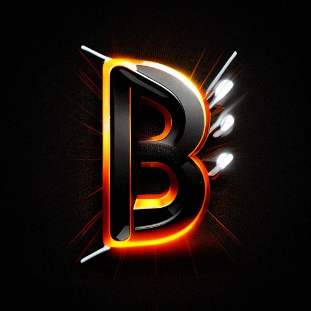

<h1 style="display: flex; align-items: end;">
    <!-- TODO: A new logo. -->
    
    <span style="margin-left: 1rem"">bel</span>
</h1>

An Erlang web framework under development.

## Why the name Bel?

The name, like the [bel unit](https://en.wikipedia.org/wiki/Decibel), is in honor of [Alexander_Graham_Bell](https://en.wikipedia.org/wiki/Alexander_Graham_Bell), the inventor of the telephone. Would we have the Erlang OTP without him?

## Build

```shell
$ rebar3 compile
```
